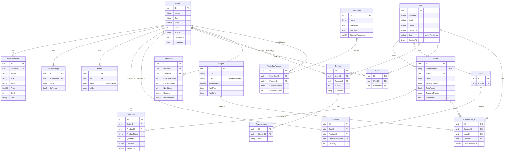

# System Entity Relationship Diagram (ERD)

```mermaid
erDiagram
    %% User Module
    User {
        uint ID PK
        string FullName
        string Email
        string Phone
        string Password
        string Role "admin/customer"
        time CreatedAt
    }

    %% Product Module
    Product {
        uint ID PK
        string Name
        string Slug
        float64 Price
        int Stock
        string Status
        uint CategoryID
        time CreatedAt
    }

    ProductVariant {
        uint ID PK
        uint ProductID FK
        string Name
        string Size
        string Color
        float64 Price
        int Stock
        string SKU
    }

    ProductImage {
        uint ID PK
        uint ProductID FK
        string URL
        bool IsPrimary
    }

    Media {
        uint ID PK
        uint ProductID FK
        string Type "image/video"
        string URL
    }

    %% Order Module
    Order {
        uint ID PK
        string OrderNumber "Unique"
        uint UserID FK
        string Status
        string PaymentStatus
        float64 TotalAmount
        string TrackingNumber
        time CreatedAt
    }

    OrderItem {
        uint ID PK
        uint OrderID FK
        uint ProductID FK
        string ProductName
        int Quantity
        float64 UnitPrice
        float64 TotalPrice
    }

    %% Cart Module
    Cart {
        uint ID PK
        uint UserID FK
    }

    CartItem {
        uint ID PK
        uint CartID FK
        uint ProductID FK
        uint ProductVariantID FK
        int Quantity
    }

    %% Stock & Logging
    StockLog {
        uint ID PK
        uint ProductID FK
        uint VariantID FK
        int ChangeAmount
        int PreviousStock
        int NewStock
        string Reason
        string ReferenceID
    }

    %% Marketing Module
    Coupon {
        uint ID PK
        string Code
        string Type "percentage/fixed"
        float64 DiscountValue
        time ValidFrom
        time ValidUntil
    }

    CouponUsage {
        uint ID PK
        uint CouponID FK
        uint UserID FK
        uint OrderID FK
        float64 DiscountAmount
    }

    FlashSale {
        uint ID PK
        string Name
        time StartTime
        time EndTime
        float64 DiscountPercentage
    }

    FlashSaleProduct {
        uint ID PK
        uint FlashSaleID FK
        uint ProductID FK
        float64 FlashSalePrice
        int FlashSaleStock
    }

    %% Social Module
    Review {
        uint ID PK
        uint UserID FK
        uint ProductID FK
        int Rating
        string Comment
    }

    ReviewImage {
        uint ID PK
        uint ReviewID FK
        string URL
    }

    Wishlist {
        uint ID PK
        uint UserID FK
        uint ProductID FK
    }

    %% Relationships
    User ||--o{ Order : places
    User ||--|| Cart : owns
    User ||--o{ Review : writes
    User ||--o{ Wishlist : maintains
    User ||--o{ CouponUsage : uses

    Product ||--o{ ProductVariant : has
    Product ||--o{ ProductImage : has
    Product ||--o{ Media : has
    Product ||--o{ OrderItem : included_in
    Product ||--o{ CartItem : included_in
    Product ||--o{ Wishlist : saved_in
    Product ||--o{ Review : receives
    Product ||--o{ StockLog : tracked_by
    Product ||--o{ FlashSaleProduct : participates_in

    Order ||--o{ OrderItem : contains
    Order ||--o{ CouponUsage : applies

    Cart ||--o{ CartItem : contains

    Review ||--o{ ReviewImage : has

    Coupon ||--o{ CouponUsage : tracked_in

    FlashSale ||--o{ FlashSaleProduct : includes
```
